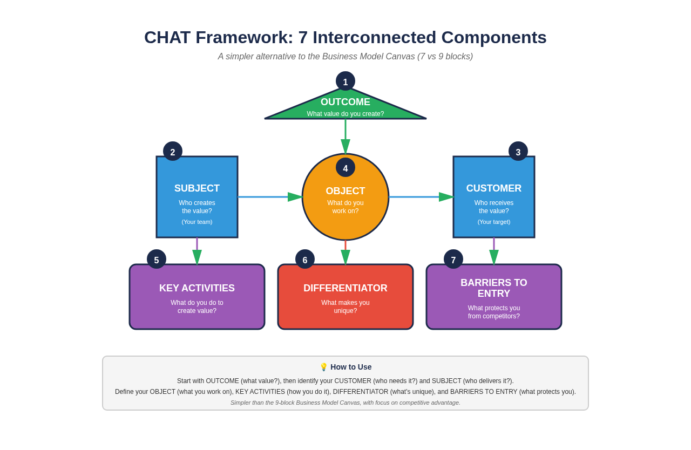

# CHAT Business Model Framework (SA Edition)

**A Guide for South African SMMEs**

**Author:** Manus AI  
**Date:** October 18, 2025  
**Version:** 1.0

---

## 1. Introduction: Beyond the Business Model Canvas

For years, the Business Model Canvas (BMC) has been the go-to tool for visualizing business models. However, its 9-block structure can sometimes feel rigid or overly complex for early-stage SMMEs. The **CHAT Business Model Framework** offers a more dynamic, narrative-driven alternative that focuses on the relationships between key business components.

Developed from Activity Theory by researchers like Vygotsky, Leont'ev, and Engeström [1], the CHAT framework helps you tell the story of how your business creates value. It's a powerful tool for clarifying your strategy, identifying competitive advantages, and communicating your vision to stakeholders.

This guide will walk you through the 7 components of the CHAT framework, using a practical South African example to illustrate each concept.

---

## 2. The CHAT Framework Explained

The CHAT framework is visualized as a triangle with 7 interconnected components. At its core, the framework describes how a **Subject** (your business) acts on an **Object** (your assets) to produce an **Outcome** (your product/service) for a **Customer**.

This core activity is influenced by:
- **The Differentiator:** Your unique "secret sauce"
- **Barriers to Entry:** Your competitive moat
- **Key Activities:** Your division of labor

  
*Figure 1: The 7 Interconnected Components of the CHAT Framework*

Let's explore each component in detail.

---

## 3. The 7 Components of CHAT

### **Component 1: The Subject**

**Who are you?**

The Subject is your business - the entity that acts on the market. It's more than just your company name; it's your team, your culture, your values, and your mission.

> "The Subject is the individual or group whose point of view is taken in the analysis." [2]

**SA Example:** A small bakery in Cape Town called "Sourdough Sanctuary". Their Subject is not just the bakery, but the team of artisanal bakers, their commitment to traditional methods, and their passion for quality ingredients.

### **Component 2: The Object**

**What do you have?**

The Object represents the assets and resources you use to create value. These are typically things you **buy or acquire**, not things you make.

**SA Example:** For Sourdough Sanctuary, the Object includes:
- High-quality, stone-ground flour from a local mill
- Specialized baking ovens
- Their unique sourdough starter culture
- The physical bakery space in a high-foot-traffic area

### **Component 3: The Outcome**

**What do you produce?**

The Outcome is the final product or service you deliver to your customers. It's the tangible result of your business activities.

**SA Example:** The Outcome for Sourdough Sanctuary is a range of artisanal sourdough breads, pastries, and sandwiches, beautifully packaged and ready for customers.

### **Component 4: The Differentiator**

**What makes you unique?**

The Differentiator is your "secret sauce" - the unique value you infuse into everything you do. It's what sets you apart from the competition.

**SA Example:** Sourdough Sanctuary's Differentiator is their commitment to a **100% authentic, 72-hour fermentation process**. This results in a unique flavor and texture that customers can't find anywhere else.

### **Component 5: Barriers to Entry**

**What protects you?**

Barriers to Entry are the competitive advantages that protect your business from being easily copied. These can be tangible (like patents) or intangible (like brand reputation).

**SA Example:** Sourdough Sanctuary's Barriers to Entry include:
- **The complexity of their 72-hour process** (hard to replicate)
- **Their loyal customer base** and strong word-of-mouth reputation
- **Exclusive relationships** with local flour suppliers
- **The prime location** of their bakery

### **Component 6: The Customer**

**Who do you serve?**

The Customer component requires you to think beyond just the payer. It includes:
- **The User:** The person who actually uses your product/service
- **The Payer:** The person who pays for it
- **The Community:** The broader group of stakeholders you impact

**SA Example:** For Sourdough Sanctuary:
- **User:** Health-conscious foodies who appreciate artisanal quality
- **Payer:** Often the same as the user, but could be a spouse or family member
- **Community:** The local neighborhood, other small businesses, and the broader Cape Town foodie scene

### **Component 7: Key Activities**

**How do you do it?**

Key Activities represent the division of labor in your business - the specific tasks and processes required to create your Outcome.

**SA Example:** Sourdough Sanctuary's Key Activities include:
- Sourcing ingredients
- Mixing and kneading dough
- Managing the 72-hour fermentation process
- Baking and quality control
- Customer service and sales
- Marketing and social media

---

## 4. Building Your CHAT Model

Now it's your turn! Use the included Excel template to map out the 7 components of your own business. Be specific and honest in your analysis.

| Component | Questions to Ask |
|---|---|
| **Subject** | Who are we? What are our values? What is our mission? |
| **Object** | What key assets and resources do we rely on? |
| **Outcome** | What is the final product/service we deliver? |
| **Differentiator** | What is our unique "secret sauce"? |
| **Barriers to Entry** | What protects us from competition? |
| **Customer** | Who is our user, payer, and community? |
| **Key Activities** | What are the core tasks we perform? |

---

## 5. Conclusion

The CHAT framework is a powerful tool for any South African SMME looking to gain clarity on their business model. By understanding the relationships between these 7 key components, you can make better strategic decisions, strengthen your competitive position, and tell a more compelling story to customers, investors, and your team.

---

## References

[1] Engeström, Y. (2015). *Learning by expanding: An activity-theoretical approach to developmental research*. Cambridge University Press.

[2] Kaptelinin, V., & Nardi, B. A. (2006). *Acting with technology: Activity theory and interaction design*. MIT press.

