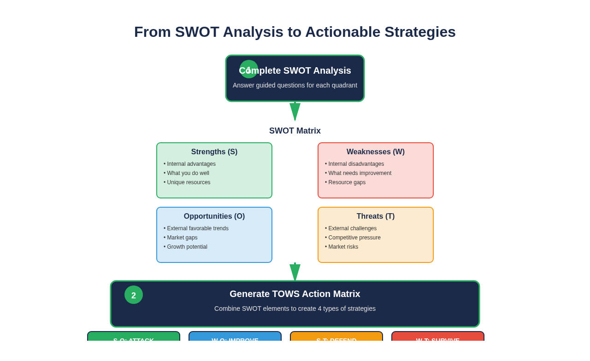

# The Ultimate SWOT Analysis Pack for South African SMMEs

**Author:** Manus AI for Operiva  
**Date:** October 18, 2025  
**Version:** 2.0

---

## 1. Introduction: Beyond the Basic SWOT

The standard SWOT analysis—Strengths, Weaknesses, Opportunities, Threats—is a great starting point, but it often leaves business owners with lists, not actions. In the high-pressure South African market, you need a tool that helps you **decide what to do next**.

This guide introduces a more powerful, action-oriented approach that combines the simplicity of SWOT with the strategic power of a **TOWS Matrix**. We’ve also embedded **guided, SA-specific questions** to help you think critically about your unique business environment.

> **What is a TOWS Matrix?**
> The TOWS Matrix was developed by Heinz Weihrich to take SWOT analysis a step further. Instead of just listing factors, it forces you to combine them to create four distinct types of strategies. This turns your analysis into a concrete action plan [1].

*Figure 1: The SWOT to TOWS Process - Transform analysis into four types of actionable strategies*

---

## 2. Step 1: Guided SWOT Analysis (The Questions)

Forget blank boxes. Use these guided questions to build a SWOT analysis that reflects the reality of running a business in South Africa.

### **Internal Factors (Your Business)**

#### **Strengths: What are your advantages?**

*   **Customer Praise:** What do your customers consistently compliment you on? (e.g., "Your service is so personal," "Your products are top quality.")
*   **Unique Assets:** What specific skill, resource, or knowledge do you have that your direct competitors don’t?
*   **Team & Culture:** What makes your team special? (e.g., highly skilled, loyal, great at problem-solving).
*   **Achievements:** What is the single greatest thing your business has accomplished so far?
*   **SA Context:** Do you have a Level 1 B-BBEE score? A strong local supply chain? A brand that resonates with your community?

#### **Weaknesses: What can you improve?**

*   **Customer Complaints:** What are the most common complaints you receive?
*   **Operational Gaps:** Where do things consistently go wrong? (e.g., late deliveries, stock shortages).
*   **Financial Literacy:** Do you use a formal system (like a spreadsheet or software) to track income and expenses? If not, what’s holding you back? [2]
*   **Skills Gaps:** What critical skill is your team missing?
*   **SA Context:** How many hours or sales did you lose to loadshedding last month? What is your current backup power solution?

### **External Factors (Your Market)**

#### **Opportunities: What can you leverage?**

*   **Market Trends:** Is there a growing trend your business can tap into? (e.g., demand for locally-made goods, eco-friendly products, online delivery).
*   **Technology:** Are there affordable digital tools you could use to reach more customers? (e.g., Yoco, iKhokha, simple online store builders) [3].
*   **Competitor Gaps:** What are your competitors doing poorly that you could do better?
*   **SA Context:** Are you aware of funding or support from agencies like SEDA, the DTI, or the IDC? Could you benefit from these?

#### **Threats: What could harm you?**

*   **Competitors:** Who are your main competitors, and what are they doing that could hurt your business?
*   **Economic Pressures:** How does the rising cost of fuel, electricity, or raw materials affect your profitability?
*   **Market Changes:** Are customer needs or technologies changing in a way that could make your offerings obsolete?
*   **SA Context:** How do local crime rates impact your business hours, staff safety, or insurance costs? Are there new regulations (e.g., B-BBEE codes) that could affect you?

---

## 3. Step 2: The TOWS Action Matrix

Now, let’s turn your lists into a real strategy. The TOWS Matrix helps you combine your internal and external factors to create four types of actions.

| | **Strengths (S)** | **Weaknesses (W)** |
|---|---|---|
| **Opportunities (O)** | **SO: “Maxi-Maxi” Strategies** How can you use your Strengths to maximize your Opportunities? | **WO: “Mini-Maxi” Strategies** How can you use Opportunities to minimize your Weaknesses? |
| **Threats (T)** | **ST: “Maxi-Mini” Strategies** How can you use your Strengths to minimize your Threats? | **WT: “Mini-Mini” Strategies** How can you minimize your Weaknesses to avoid Threats? |

### **Example: Sourdough Sanctuary (Cape Town Bakery)**

#### **SWOT Analysis:**
*   **S:** Loyal customer base, unique 72-hour fermentation process.
*   **W:** Limited online presence, reliant on one key baker.
*   **O:** Growing demand for artisanal food, local markets are popular.
*   **T:** Rising flour costs, loadshedding disrupts baking schedule.

#### **TOWS Action Matrix:**

*   **SO Strategy (Attack):**
    *   Use our unique fermentation process (S) to create a premium "Sourdough of the Month" club for our loyal customers (S) and promote it at local markets (O).
*   **ST Strategy (Defend):**
    *   Use our loyal customer base (S) to launch a pre-order system to better manage baking schedules and reduce waste during loadshedding (T).
*   **WO Strategy (Improve):**
    *   Leverage the growing demand for online delivery (O) by using an affordable tool like Shopify Lite to build a simple online store, overcoming our limited online presence (W).
*   **WT Strategy (Survive):**
    *   To minimize our reliance on one baker (W) and mitigate rising flour costs (T), we will document our fermentation process and train a second baker, while also exploring long-term contracts with local flour mills.

---

## 4. Your Next Steps

1.  **Complete the Worksheet:** Use the Excel template in this pack (`03-SWOT-Analysis-Worksheet.xlsx`) to complete the guided SWOT questions and fill in your own TOWS matrix.
2.  **Prioritize:** You can’t do everything at once. Choose the top 1-2 strategies from your TOWS matrix that will have the biggest impact on your business right now.
3.  **Take Action:** Break down your chosen strategies into small, manageable steps and assign deadlines.

Strategy is not a one-time event. Revisit this analysis every 6-12 months to stay agile and responsive to the ever-changing South African market.

---

## References

[1] Weihrich, H. (1982). The TOWS matrix—A tool for situational analysis. *Long Range Planning, 15*(2), 54-66. [https://doi.org/10.1016/0024-6301(82)90120-0](https://doi.org/10.1016/0024-6301(82)90120-0)

[2] Fatoki, O. (2014). The Causes of the Failure of New Small and Medium Enterprises in South Africa. *Mediterranean Journal of Social Sciences, 5*(20), 922-927. [https://www.richtmann.org/journal/index.php/mjss/article/view/4262](https://www.richtmann.org/journal/index.php/mjss/article/view/4262)

[3] Yoco. (2023). *The Yoco 2023 Small Business Report*. [https://www.yoco.com/za/small-business-report/](https://www.yoco.com/za/small-business-report/)

